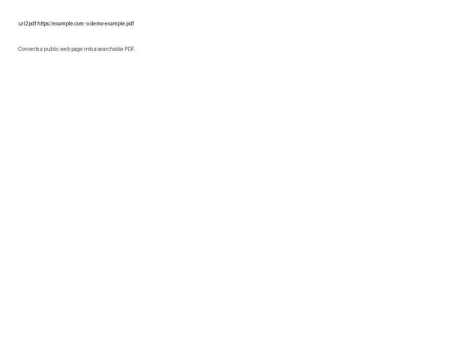

# url2pdf

**Convert web pages to searchable PDFs from the command line, Python, or a small desktop GUI.**

[](https://github.com/a-i-am/url2pdf/actions/workflows/ci.yml)
[](https://pypi.org/project/url2pdf/)
[](https://pypi.org/project/url2pdf/)
[](LICENSE)

> Korean README: [README.ko.md](README.ko.md)

## Demo



## Features

- Browser-based rendering with Playwright Chromium.
- Lazy-load scrolling for pages that load content while scrolling.
- Searchable, selectable PDF output for normal HTML pages.
- Desktop GUI: `url2pdf-gui`.
- Capture profiles: faithful, evidence metadata, and reading mode.
- Recipe JSON actions for click, wait, and scroll before capture.
- OCR mode for image-heavy pages with Tesseract.
- Page layout option: normal pages or one long PDF page.
- Batch conversion, session file support, preview, and connection check mode.

All conversion runs locally. url2pdf does not send your URL or PDF content to an external service.

## Installation

```bash
pip install url2pdf
playwright install chromium
```

OCR needs the optional Python packages and the Tesseract binary:

```bash
pip install "url2pdf[ocr]"
```

Install Tesseract separately, then add language data as needed. For Korean OCR, use `kor+eng` and make sure Korean trained data is installed.

Requires Python 3.10+.

## Quick Start

```bash
# Basic PDF
url2pdf https://example.com

# Save to a specific path
url2pdf https://example.com -o report.pdf

# Open the desktop GUI
url2pdf-gui

# One long PDF page instead of normal page breaks
url2pdf https://example.com --pdf-layout single

# OCR PDF for image-heavy pages
url2pdf https://example.com --ocr --ocr-lang eng

# Korean + English OCR
url2pdf https://example.com --ocr --ocr-lang kor+eng

# Run a recipe before capture
url2pdf https://example.com --recipe actions.json

# Test a recipe visually without generating a PDF
url2pdf https://example.com --recipe actions.json --test-recipe

# Batch conversion from a text file
url2pdf --batch urls.txt
```

## GUI

Run:

```bash
url2pdf-gui
```

The GUI supports URL input, output selection, capture profiles, PDF preview, recipe JSON, OCR language, Tesseract path, and page layout selection.

## Recipe JSON

Recipe JSON runs small browser actions before PDF capture.

```json
[
  { "action": "wait", "ms": 2000 },
  { "action": "click", "selector": "#agree-btn", "optional": true },
  { "action": "scroll" }
]
```

Supported actions:

| Action | Fields | Description |
|---|---|---|
| `wait` | `ms` | Waits 0-60000 milliseconds. |
| `click` | `selector`, `optional` | Clicks a CSS selector. Optional clicks ignore missing elements. |
| `scroll` | `selector` optional | Scrolls the page or a selected scroll container. |

Built-in presets:

```bash
url2pdf https://example.com --recipe dismiss-cookies
url2pdf https://example.com --recipe lazy-load
url2pdf https://example.com --help-recipe
```

## CLI Reference

| Flag | Default | Description |
|---|---|---|
| `url` | optional with `--batch` | URL to convert. |
| `-o`, `--output` | page title | Output PDF path or directory. |
| `--batch FILE` | off | Convert URLs listed in a text file. |
| `--check` | off | Check HTTP connection only. |
| `--format FORMAT` | `A4` | Paper format such as `A4`, `Letter`, or `A3`. |
| `--pdf-layout pages\|single` | `pages` | Normal page breaks or one long page. |
| `--scale SCALE` | `0.9` | PDF scale from 0.1 to 2.0. |
| `--timeout SECONDS` | `60` | Page load timeout. |
| `--scroll-rounds N` | `80` | Max scroll attempts for lazy content. |
| `--profile faithful\|evidence\|reading` | `faithful` | Capture profile. |
| `--preview` | off | Open the generated PDF with the OS default viewer. |
| `--recipe FILE_OR_PRESET` | off | Run recipe actions before capture. |
| `--help-recipe` | off | Show recipe help. |
| `--test-recipe` | off | Run recipe visibly and exit without PDF output. |
| `--ocr` | off | Generate an OCR PDF from a full-page screenshot. |
| `--ocr-lang LANG` | `eng` | Tesseract language, for example `eng` or `kor+eng`. |
| `--tesseract-cmd PATH` | auto | Path to the Tesseract executable. |
| `--session FILE` | off | Playwright `storageState.json` for logged-in sessions. |
| `--headed` | off | Show Chromium while converting. |
| `--manual-verification` | off | Pause when browser verification is detected. |
| `--lang auto\|ko\|en` | `auto` | CLI and GUI message language. |
| `-q`, `--quiet` | off | Suppress progress output. |

## Python API

```python
from url2pdf import convert

path = convert(
    "https://example.com",
    output="report.pdf",
    page_format="A4",
    pdf_layout="pages",
    profile="faithful",
    timeout=60,
)

print(path)
```

OCR:

```python
from url2pdf import convert

convert(
    "https://example.com",
    output="ocr.pdf",
    ocr=True,
    ocr_lang="eng",
    tesseract_cmd=r"C:\Program Files\Tesseract-OCR\tesseract.exe",
)
```

## Limitations

- OCR quality depends on Tesseract, installed language data, source image quality, and the PDF viewer. Text search may work even when selection boxes are not perfectly aligned.
- Sites with bot protection, paywalls, or aggressive anti-automation may require `--headed`, `--manual-verification`, or a session file.
- Reading mode is heuristic. It can remove useful content on unusual pages.
- Very long image-heavy pages can create large OCR PDFs.

## Development

```bash
git clone https://github.com/a-i-am/url2pdf
cd url2pdf
pip install -e ".[dev,ocr]"
playwright install chromium

pytest
ruff check src tests
mypy src
python -m build
```

## Release Notes

### v1.2.1

- Added the `url2pdf-gui` desktop GUI.
- Added OCR language and Tesseract path controls.
- Added `--pdf-layout pages|single`.
- Added recipe builder/help flow in the GUI and recipe test mode in the CLI.
- Improved print preparation for page breaks, lazy images, fonts, overlays, and wide layouts.
- Added packaging and regression tests for GUI option forwarding, OCR text normalization, and layout options.

## License

[MIT](LICENSE) © Sieun Park
